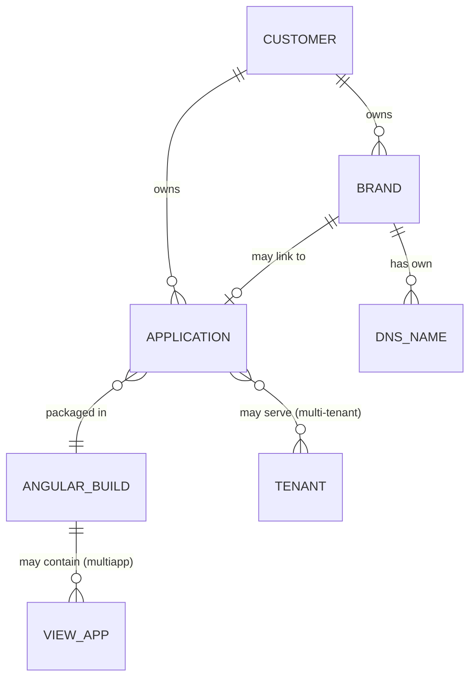
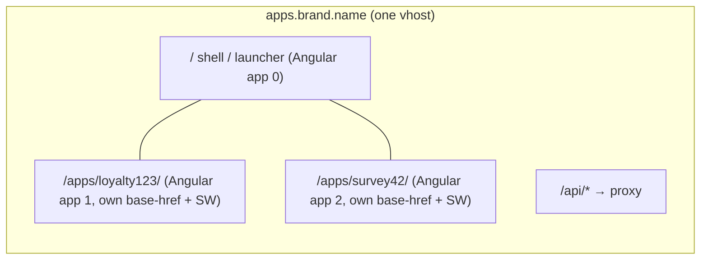
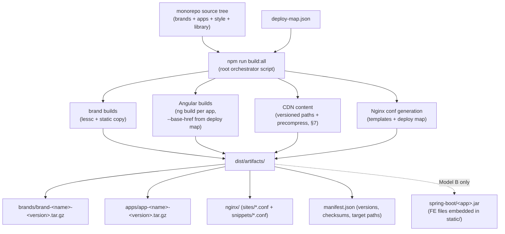
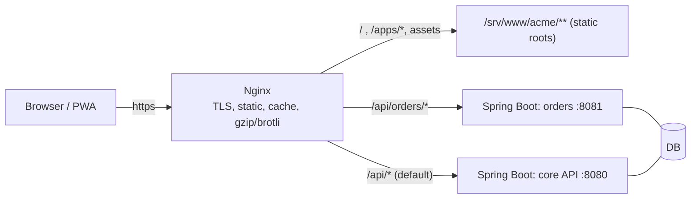
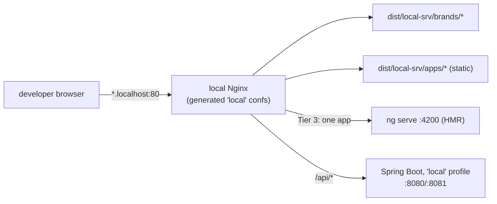
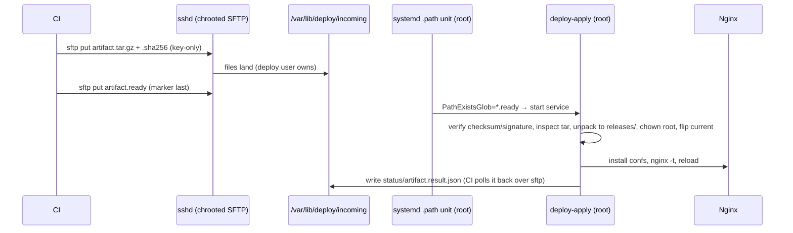

# Design — 1 customer, N brands, M apps: DNS, URLs, artifacts, Nginx

Status: **plan / design only — no implementation yet.**
Related documents: [README.md](README.md) ("Brand vs. web-page/app styling", "Brand example",
"Environments"), [review.md](review.md) §1 (environment naming, ADR-0041/ADR-0042) and §2
(brand vs. web-page/app split), `packages/angular-start-project-brand-style/` (the brand LESS
module and its `brand-example/`, the existing concrete brand artifact example),
`angular-start-project-library`'s `tenantService.js` (hostname → tenant resolution).

---

## 1. Problem statement and domain model

One **customer** orders several **brand pages** (fancy, product/trademark-oriented marketing
pages — simple content, high visual freedom) and several **applications** (Angular PWA
webapps — enterprise/utility look, this template's category). Brands and apps are owned by the
same customer but have independent naming: a brand can live on its own DNS name (`brand.name`),
apps can live beside it (`apps.brand.name`) or under it (`brand.name/apps/<appId>`). Some apps
are small enough to be "one view = one application" inside a single Angular build; others are
full separate Angular projects. **Everything builds in one go from one source tree** (this
starter, renamed/refactored per customer) and comes out as installable artifacts: brand pages,
app bundles, and Nginx configuration files an admin can apply directly.



- **Brand** — static artifact. Same LESS design system available (`setmy-info-less` base via
  the dedicated `angular-start-project-brand-style` module — apps have different CSS than
  brands, so brand LESS is its own workspace package; optionally the `fancy` layer once it
  exists), same build framework/toolchain present in the monorepo, but **zero Angular runtime**
  (per review.md §2: a brand is a different deployable artifact, not a themed mode of the app).
- **Application** — Angular PWA built from this template. May itself be multi-tenant
  (tenant chosen by hostname, see §5) and may be a *multiapp* (several small "one view = one
  app" units inside one Angular build).

Two deployment models are supported (both designed here, §8 and §9), plus a shared
first-party CDN role for Nginx (§7):

- **Model A (preferred): Nginx serves frontend files and proxies APIs** to Spring Boot
  services. Node.js is never used as an API or file server.
- **Model B: single Spring Boot jar** that serves both the API endpoints and the frontend
  files from its embedded Tomcat. Nginx optionally stays in front as TLS terminator/proxy.

---

## 2. DNS naming pattern

### 2.1 Canonical pattern

The scheme has three axes: **what** (brand vs app), **which environment** (ADR-0041/ADR-0042
canonical names: `local`, `dev`, `ci`, `test`, `prelive`, `live`), and **which tenant** (for
multi-tenant apps). Rules, in order:

| Thing | Live DNS name | Non-live environments |
|---|---|---|
| Brand page | `brand.name` (apex; customer-registered, fully independent name) + `www.brand.name` → 301 to apex | `dev.brand.name`, `test.brand.name`, `prelive.brand.name`, … |
| App platform of a brand (small apps, mounted at paths) | `apps.brand.name` | `dev.apps.brand.name`, … |
| Big / standalone app | `<app>.apps.brand.name` — or its own registered domain if the customer wants one | `dev.<app>.apps.brand.name`, … |
| Multi-tenant app, tenant selection | `<tenant>.<app>.apps.brand.name` (tenant is always the **leftmost** label) | env prefix goes left of tenant only via separate zone, see §2.3 |

Key decisions:

1. **Host-based selection is primary.** Nginx picks brand vs app vs tenant by `server_name`.
   This keeps every deployable a plain static root with its own caching policy, its own PWA
   service-worker scope, and its own TLS cert (or one wildcard per zone).
2. **Path-based mounting is the secondary pattern** for the "N small apps" case:
   `apps.brand.name/apps/<appId>/`. One vhost, many Angular apps, each built with its own
   `--base-href`. Use it when apps are numerous and small; promote an app to its own hostname
   when it grows (the artifact does not change — only the Nginx mount and base-href do).
3. **Environment name is a prefix label**, matching the existing convention
   (`dev.angular-start-project.setmy.info` in `angular.json` today). `live` has **no** prefix.

### 2.2 Examples for one concrete customer

Customer *ACME* with two brands and four apps:

```
acmecoffee.example              → brand page "acmecoffee"      (static, fancy)
acmetools.example               → brand page "acmetools"       (static, fancy)
apps.acmecoffee.example         → app platform (multiapp shell + small apps at /apps/…)
apps.acmecoffee.example/apps/loyalty123/   → small app "loyalty123" (one view = one app)
crm.apps.acmetools.example      → big standalone app "crm"
shopA.crm.apps.acmetools.example → tenant "shopA" of multi-tenant app "crm"
dev.apps.acmecoffee.example     → dev environment of the app platform
```

### 2.3 Tenant vs environment label — the one rule to keep straight

`tenantService.getTenant()` currently returns the **leftmost hostname label**. That collides
with the environment prefix (`dev.crm…` would resolve tenant "dev"). Decision:

- **Live**: leftmost label = tenant. Works as-is.
- **Non-live**: use a per-environment zone so the tenant stays leftmost:
  `shopA.crm.apps.dev.acmetools.example` (env label moves inward), **or** simpler and
  recommended: Nginx injects the tenant explicitly (config JSON per vhost, or an
  `TenantId` header baked into a generated `config/tenant.json` the app fetches), and
  `tenantService` prefers that over hostname parsing. This removes all hostname ambiguity and
  is a small, planned library change (design decision recorded here; implementation later).

---

## 3. URL path and Angular route design

### 3.1 Path layout per vhost

| Path | Meaning | Served by |
|---|---|---|
| `/` | brand page (on brand hosts) or app-platform launcher/default app (on app hosts) | static files |
| `/apps/<appId>/` | one mounted Angular app (path-based multiapp) | static files, own base-href |
| `/api/` | API gateway prefix — **reserved on every vhost**, never used by frontend routing | proxy → Spring Boot |
| `/api/<service>/` | one microservice | proxy → that service's upstream |
| `/assets/`, hashed `*.js/*.css` | immutable build output | static, `Cache-Control: immutable` |
| `/ngsw-worker.js`, `/index.html`, `/manifest.webmanifest` | PWA control files | static, `no-cache` |

Reserving `/api/` uniformly means one Nginx snippet handles API proxying identically on every
vhost, and Angular routes must simply never start with `api` (add a lint/convention note).

### 3.2 Angular router paths

- Inside each app, router paths stay exactly as today (`/`, `/about`, `/contact`,
  `/settings`, `/terms`, `/privacy`, `**` fallback). Apps are **base-href agnostic**: the same
  routes work at `/` (host-mounted) and at `/apps/loyalty123/` (path-mounted) because the
  build sets `--base-href` and `--deploy-url`; the router is always relative to base href.
- **Multiapp inside one Angular build** ("one view = one application"): each mini-app is a
  lazy-loaded route subtree, `/apps/<appId>` → `loadChildren`. The shell app provides the
  launcher list at `/`. This is the cheapest multiapp form: one build, one service worker, one
  deploy. Choose it when the mini-apps share release cadence and users.
- **Separate Angular projects** (own `angular.json` project or own workspace package cloned
  from this starter): choose when release cadence, teams, or size diverge. Same artifact
  contract (§4), so Nginx does not care which form produced the bundle.
- **PWA note:** a service worker's scope is its base href. Path-mounted apps therefore get
  independent service workers (`/apps/a/ngsw-worker.js` vs `/apps/b/ngsw-worker.js`) — this is
  desired (independent update cycles) and works without extra headers as long as each app's
  files stay under its own path prefix.



---

## 4. Artifact design — one build, one output tree

### 4.1 The deploy map is the single source of truth

One file at the repo root, `deploy-map.json` (name and shape to be finalized), declares the
customer, brands, apps, their DNS names, mounts, environments, and API upstreams. **Everything
else is generated from it**: Nginx server files, base-href build flags, artifact names, and the
install manifest. Example shape:

```jsonc
{
  "customer": "acme",
  "brands": [
    { "name": "acmecoffee", "domain": "acmecoffee.example", "source": "packages/brand-acmecoffee" }
  ],
  "apps": [
    { "name": "platform", "mount": { "type": "host", "domain": "apps.acmecoffee.example" },
      "source": "packages/angular-start-project", "multiapp": true },
    { "name": "loyalty123", "mount": { "type": "path", "under": "apps.acmecoffee.example", "path": "/apps/loyalty123/" },
      "source": "packages/app-loyalty123" },
    { "name": "crm", "mount": { "type": "host", "domain": "crm.apps.acmetools.example" },
      "source": "packages/app-crm", "multiTenant": true }
  ],
  "api": [
    { "prefix": "/api/orders/", "upstream": "http://127.0.0.1:8081" },
    { "prefix": "/api/",        "upstream": "http://127.0.0.1:8080" }
  ],
  "cdn": {
    "domain": "cdn.setmy.info",
    "sources": ["packages/cdn-content", "packages/angular-start-project-style", "packages/angular-start-project-brand-style"]
  }
}
```

### 4.2 Build pipeline (one go)



`build:all` is a plain npm script at the root (workspaces already exist), roughly:
build every brand → build every app with its base-href → render Nginx templates → tar + checksum
→ write `manifest.json`. No new tooling; `lessc`, `ng build`, and a small Node **build-time**
script for templating (build-time Node is fine — the "no Node.js" rule applies to runtime
serving only).

### 4.3 Artifact tree and server install layout

```
dist/artifacts/
├── manifest.json                        # versions, sha256, install targets
├── brands/
│   └── brand-acmecoffee-1.4.0.tar.gz    # unpacks to plain static site root
├── apps/
│   ├── app-platform-2.1.0.tar.gz        # Angular dist (browser/ output)
│   └── app-crm-0.9.0.tar.gz
├── cdn/
│   └── cdn-3.0.0.tar.gz                 # shared assets, versioned paths, precompressed (§7)
├── nginx/
│   ├── sites/acmecoffee.example.conf
│   ├── sites/apps.acmecoffee.example.conf
│   ├── sites/crm.apps.acmetools.example.conf
│   └── snippets/{pwa-app.conf, brand-static.conf, api-proxy.conf, security-headers.conf}
└── spring-boot/                         # Model B only
    └── crm-boot-0.9.0.jar
```

Server-side layout (what the confs point at — versioned dirs + `current` symlink so rollback
is one `ln -sfn`):

```
/srv/www/acme/
├── brands/acmecoffee/{releases/1.4.0/, current -> releases/1.4.0}
└── apps/{platform, loyalty123, crm}/{releases/…, current -> …}
/etc/nginx/conf.d/            # or sites-available/ + sites-enabled/ symlinks (Debian style)
/etc/nginx/snippets/acme/     # the generated shared snippets
```

Install procedure for the admin (scriptable later, manual first): unpack tars to
`releases/<version>`, flip `current` symlinks, copy `nginx/` files into place,
`nginx -t && systemctl reload nginx`. That is the whole contract.

---

## 5. Multi-tenancy inside one app

- Tenant resolution stays in `angular-start-project-library`'s `tenantService`, but per §2.3
  the primary source becomes a **generated per-vhost config**: the Nginx conf for a tenant
  hostname serves a tiny static `config/runtime.json` (generated from the deploy map) containing
  `{ "tenant": "shopA", "envName": "live", "apiBaseUrl": "/api" }`. Hostname parsing remains
  the fallback for local/dev.
- One artifact, many tenant hostnames: all `<tenant>.crm…` server names alias the **same**
  static root; only `runtime.json` (or a header) differs. Tenant-specific styling/branding
  inside an app is app logic on top of `tenantService`, not separate builds — this keeps
  "M apps × T tenants" from exploding the artifact count.
- APIs receive the tenant via a proxy header set by Nginx (`proxy_set_header TenantId …`),
  so Spring Boot services get it uniformly regardless of Model A/B. Per
  [RFC 6648](https://www.rfc-editor.org/rfc/rfc6648) the header is **not** `X-`-prefixed:
  application-defined headers get plain descriptive names (`TenantId`), never a new `X-*`.

---

## 6. Nginx configuration design

Modular: **one file per DNS name** (generated, disposable, never hand-edited) + **shared
snippets** (stable, hand-maintainable). An admin applies a change by replacing generated files
and reloading.

### 6.1 Shared snippets (installed once per customer)

`snippets/acme/brand-static.conf` — brand pages (simple static, cache hard):

```nginx
# Brand pages: fully static, no SPA fallback, cache aggressively.
index index.html;
location ~* \.(?:css|js|svg|png|jpe?g|webp|woff2?)$ {
    expires 30d;
    add_header Cache-Control "public";
}
location / {
    try_files $uri $uri/ =404;
}
```

`snippets/acme/pwa-app.conf` — Angular PWA rules (parameterized by the `location` that
includes it; `$app_root` set per site file):

```nginx
# Angular PWA: control files must revalidate; hashed bundles are immutable.
location = /index.html            { root $app_root; add_header Cache-Control "no-cache"; }
location = /ngsw-worker.js        { root $app_root; add_header Cache-Control "no-cache"; }
location = /ngsw.json             { root $app_root; add_header Cache-Control "no-cache"; }
location = /manifest.webmanifest  { root $app_root; add_header Cache-Control "no-cache"; }
location ~* \-[A-Z0-9]{8}\.(?:js|css)$ {   # Angular output hashes
    root $app_root;
    expires 1y;
    add_header Cache-Control "public, immutable";
}
location / {
    root $app_root;
    try_files $uri /index.html;            # SPA deep-link fallback
}
```

`snippets/acme/api-proxy.conf` — uniform API proxying (Model A):

```nginx
# All backend traffic under /api/ — Spring Boot only, never Node.js.
location /api/ {
    proxy_pass http://acme_api;            # upstream defined in the site file
    proxy_http_version 1.1;
    proxy_set_header Host              $host;
    # X-Forwarded-* / X-Real-IP are kept: pre-RFC-6648 de-facto standards that Spring's
    # ForwardedHeaderFilter and virtually all infrastructure understand. Our OWN headers
    # follow RFC 6648 (no X- prefix):
    proxy_set_header X-Real-IP         $remote_addr;
    proxy_set_header X-Forwarded-For   $proxy_add_x_forwarded_for;
    proxy_set_header X-Forwarded-Proto $scheme;
    proxy_set_header TenantId          $acme_tenant;   # map()-derived, see site file
}
```

### 6.2 Generated site files (one per DNS name)

Brand vhost — `sites/acmecoffee.example.conf`:

```nginx
server {
    listen 443 ssl http2;
    server_name acmecoffee.example www.acmecoffee.example;
    ssl_certificate     /etc/letsencrypt/live/acmecoffee.example/fullchain.pem;
    ssl_certificate_key /etc/letsencrypt/live/acmecoffee.example/privkey.pem;
    root /srv/www/acme/brands/acmecoffee/current;
    include snippets/acme/security-headers.conf;
    include snippets/acme/brand-static.conf;
}
```

App-platform vhost with a path-mounted mini-app and API proxy —
`sites/apps.acmecoffee.example.conf`:

```nginx
upstream acme_api { server 127.0.0.1:8080; keepalive 16; }

server {
    listen 443 ssl http2;
    server_name apps.acmecoffee.example;
    # … ssl …
    include snippets/acme/security-headers.conf;
    include snippets/acme/api-proxy.conf;

    # mini-app mounted at a path: own root, own SPA fallback, own service worker scope
    location /apps/loyalty123/ {
        alias /srv/www/acme/apps/loyalty123/current/;
        try_files $uri /apps/loyalty123/index.html;
    }

    # platform shell at /
    set $app_root /srv/www/acme/apps/platform/current;
    include snippets/acme/pwa-app.conf;
}
```

Multi-tenant app vhost — `sites/crm.apps.acmetools.example.conf`:

```nginx
# tenant = leftmost label before the app name (live pattern, §2.3)
map $host $acme_tenant {
    ~^(?<t>[^.]+)\.crm\.apps\.acmetools\.example$ $t;
    default "default";
}

server {
    listen 443 ssl http2;
    server_name crm.apps.acmetools.example *.crm.apps.acmetools.example;
    # … wildcard cert for *.crm.apps.acmetools.example …
    set $app_root /srv/www/acme/apps/crm/current;
    include snippets/acme/security-headers.conf;
    include snippets/acme/api-proxy.conf;
    include snippets/acme/pwa-app.conf;

    # per-tenant runtime config, generated at deploy time
    location = /config/runtime.json {
        root /srv/www/acme/apps/crm/tenants/$acme_tenant;
        add_header Cache-Control "no-cache";
    }
}
```

Plus one trivial port-80 server per zone doing ACME challenges + 301 → https.

---

## 7. Nginx as CDN — shared assets across brands, apps, customers

Secondary but integral plan: the same Nginx installation also acts as a **first-party CDN** —
one shared origin for common static files used by *all* tenants, customers, brands, and apps:
shared JS libraries, the compiled design-system CSS (`setmy-info-less`), fonts (e.g. the
self-hosted Material Symbols `woff2`), background videos, large images. One copy, one deploy,
one URL every artifact references.

This does **not** loosen the "no third-party CDN" rule (README.md "Design principles": no
Google Fonts/Icons links). The rule, restated precisely: assets load from an origin **we
operate** — the app's own vhost or this CDN vhost — never from someone else's CDN. The CDN
here is our own Nginx serving our own build artifacts.

### 7.1 DNS names and scopes

| Scope | Name | Contents |
|---|---|---|
| Operator-wide (all customers) | `cdn.<operator-domain>` (e.g. `cdn.setmy.info`) | design-system CSS, fonts, common JS libs, stock background media |
| Customer-wide (optional, only if a customer needs private shared assets) | `cdn.<customer-main-domain>` | that customer's shared brand videos/imagery used across their N brands and M apps |

Environment prefixes follow §2 (`dev.cdn.setmy.info`, …; `live` unprefixed). Locally (§10)
the map renders `cdn.localhost` — Tier 2 play includes the CDN vhost like any other.

### 7.2 URL scheme: everything versioned, everything immutable

```
https://cdn.setmy.info/design/setmy-info-less/4.2.0/main.min.css
https://cdn.setmy.info/fonts/material-symbols-outlined/2.0.0/material-symbols-outlined.woff2
https://cdn.setmy.info/libs/<lib>/<version>/<file>.min.js
https://cdn.setmy.info/media/backgrounds/1.0.0/hero-loop.mp4
```

One rule makes the whole CDN cacheable forever: **a versioned path never changes content.**
New content = new version segment = new URL. Therefore every path gets
`Cache-Control: public, max-age=31536000, immutable`, and there are no unversioned mutable
paths at all (no `/latest/`). Consumers (brand pages, app `index.html`s, LESS `@import url()`s)
pin exact versions; bumping a version is an ordinary source change in the consuming project,
rebuilt and redeployed through the same one-go pipeline.

### 7.3 CDN vhost — generated like every other site file

```nginx
server {
    listen 443 ssl http2;
    server_name cdn.setmy.info;
    # … ssl …
    root /srv/cdn/current;

    # Immutable by construction (§7.2) — applies to everything served here.
    add_header Cache-Control "public, max-age=31536000, immutable";

    # Fonts (and any asset fetched cross-origin) need CORS; '*' is correct for
    # public static content. Consumers use crossorigin on <link>/<script>.
    add_header Access-Control-Allow-Origin "*";

    # Precompressed at build time — Nginx serves .gz/.br siblings, no CPU at runtime.
    gzip_static on;
    # brotli_static on;   # if the brotli module is installed

    # Video: byte-range/pseudo-streaming support for background loops.
    location ~* \.mp4$ { mp4; }

    sendfile on;
    tcp_nopush on;
    open_file_cache max=10000 inactive=5m;
    open_file_cache_valid 10m;

    location / { try_files $uri =404; }
}
```

### 7.4 What belongs on the CDN — and what must not

- **Yes:** shared design-system CSS for brand pages (N brands stop each carrying their own
  compiled copy of `setmy-info-less`), fonts, background videos/large imagery, genuinely
  shared vendor JS used by static brand pages.
- **No:** Angular application bundles. `ng build` output (hashed JS/CSS) stays on the app's
  own vhost — it is already per-app, already immutable, and moving it breaks the service
  worker's same-scope update model. The CDN carries *shared and heavy* assets, never an app's
  critical path.
- **PWA interaction:** apps that use CDN assets list them in `ngsw.json` asset-group `urls`
  patterns (fonts, CSS — cacheable cross-origin), but **never precache videos**; those load
  lazily with the `mp4`/range support above. An app must render acceptably (system font,
  plain background) if the CDN is unreachable — CDN assets are progressive enhancement.
- **Honest browser-cache note:** modern browsers partition the HTTP cache by top-level site,
  so "user visits brand A, then app B, font is already cached" no longer happens across
  different registrable domains. The CDN's real wins are operational — one copy, one deploy,
  version consistency across all consumers, one tuning point, cookieless requests — plus
  server-side efficiency. Don't oversell cross-site cache hits; they mostly apply *within*
  one customer's domain tree.

### 7.5 Build and artifact integration

- New source home: `packages/cdn-content/` (media, vendor libs) plus build outputs compiled
  once (design-system CSS from `angular-start-project-style`/`angular-start-project-brand-style`/`setmy-info-less`).
- `deploy-map.json` gets a top-level `cdn` section (domain per scope, content sources,
  versions); `build:all` produces `dist/artifacts/cdn/cdn-<version>.tar.gz` (with `.gz`/`.br`
  siblings precompressed) and the generated `nginx/sites/cdn.<domain>.conf`. Install is
  identical to every other artifact: unpack to `/srv/cdn/releases/<version>`, flip `current`.
- Because paths are versioned (§7.2), multiple releases coexist in one root — "flip the
  symlink" for the CDN usually means "the new release dir also contains all still-referenced
  old versions" or simpler: releases are **additive**, unpacked into the same tree, and
  pruning old versions is an explicit admin/cleanup step, never automatic.

### 7.6 Scale-out path (later, unchanged design)

If one box stops being enough, the same generated conf becomes the **origin**, and additional
edge Nginx nodes in front use standard `proxy_cache`:

```nginx
proxy_cache_path /var/cache/nginx/cdn keys_zone=cdn:100m max_size=20g inactive=30d;
server {
    server_name cdn.setmy.info;
    location / {
        proxy_pass https://origin.cdn.setmy.info;
        proxy_cache cdn;
        proxy_cache_valid 200 30d;
        proxy_cache_use_stale error timeout updating;
    }
}
```

Nothing about URLs, artifacts, or consumers changes — that is the point of §7.2's
immutability rule.

## 8. Deployment Model A — Nginx frontend + Spring Boot APIs (preferred)



- Nginx owns: TLS, HTTP/2, compression, caching policy, SPA fallback, tenant mapping,
  API routing. Spring Boot owns: business logic only, bound to localhost (or an internal
  network), never exposed directly.
- Scales each concern independently; frontend deploys (flip a symlink) never touch the
  backend and vice versa. This is the default for every new customer setup.

## 9. Deployment Model B — single Spring Boot jar (FE + API together)

For the "simplest possible single unit" case (one small app, one service, one box):

- The monorepo build copies the app's Angular `dist/**/browser/*` into the Boot project's
  `src/main/resources/static/` (or attaches it into the jar during `build:all` packaging), so
  the jar serves the frontend from embedded Tomcat and its own `/api/**` controllers.
- Required Boot-side pieces (design, to implement later): an SPA forwarding rule (unknown
  non-`/api` paths → `index.html`), correct cache headers mirroring §6.1's PWA rules
  (`no-cache` for `index.html`/`ngsw*`, long/immutable for hashed assets), and the same
  `/config/runtime.json` idea for tenant/env if needed.
- **Nginx still recommended in front** even in Model B (TLS termination, one place for DNS
  vhosts, ability to later split FE out without re-architecting) — but the jar must remain
  fully functional standing alone, so tiny installs can skip Nginx entirely.
- The deploy map gets a per-app flag (`"packaging": "nginx-static" | "boot-jar"`), and the
  artifact tree's `spring-boot/` directory is produced only for `boot-jar` apps. URL design,
  Angular base-href rules, and tenant rules are **identical** in both models — only the
  serving process differs.

**Choosing:** default to Model A. Pick Model B per-app only when the deployment target is a
single small server/container and the operational simplicity of one process outweighs
independent FE/BE deploys.

---

## 10. Local development — playing with all of it on one machine

Hard rule first: **no new profiles/configurations are ever added for this.** The canonical
environment names (`local`, `dev`, `ci`, `test`, `prelive`, `live` — ADR-0041/ADR-0042, see
README.md "Environments" and review.md §1) are the complete, closed set. Everything below runs
under the **existing `local` environment**: `ng serve`'s default configuration, `build:all`
invoked for `local`, and Spring Boot started with the `local` profile. If a local workflow
seems to need a new configuration, the workflow is wrong, not the rule.

A developer plays at three tiers, from fastest loop to fullest fidelity:

| Tier | What runs | What it exercises | Loop speed |
|---|---|---|---|
| 1 — single unit | `npm start -w <app>` (ng serve, `local`); brands: `npm run build:brand-example -w angular-start-project-brand-style` + open the HTML file | one app or one brand in isolation; HMR, unit tests | seconds |
| 2 — full topology | `build:all` for `local` + local Nginx on port 80 with the **generated** `*.localhost` confs + Spring Boot services (`local` profile) on their deploy-map ports | DNS-name selection, brand-vs-app routing, path mounts, base-href, PWA/service-worker scopes, `/api/` proxying, tenant mapping | a rebuild per change |
| 3 — mixed | Tier 2, but the one app under active development is proxied by Nginx to its `ng serve` instead of static files | full topology **around** a hot-reloading app | seconds, inside real routing |

### 10.1 Local DNS names

The deploy map's `local` environment section maps every production name onto the `.localhost`
TLD, which resolves to `127.0.0.1` by RFC 6761 on modern systems (systemd-resolved, all major
browsers) — no DNS setup at all in the common case:

```
acmecoffee.example              → acmecoffee.localhost
apps.acmecoffee.example         → apps.acmecoffee.localhost
crm.apps.acmetools.example      → crm.apps.acmetools.localhost
shopA.crm.apps.acmetools.example → shopa.crm.apps.acmetools.localhost
```

Where `.localhost` resolution is not available (older resolvers, some VMs), `build:all` also
emits `nginx/hosts.local` — ready-made `/etc/hosts` lines for every name in the map. Hosts
files cannot do wildcards, so multi-tenant play lists each tenant **explicitly named in the
deploy map**; that is enough for development (dnsmasq is a per-developer option, never a
requirement).

### 10.2 Local Nginx = the same generated confs

Tier 2 does not use hand-written dev Nginx config. The same templates render the `local`
variant: same snippets, same site files, only (a) `server_name`s are the `.localhost` names,
(b) `listen 80` plain HTTP — no TLS locally (mkcert is an optional extra, not part of the
design), and (c) roots point into the developer's working tree
(`<repo>/dist/local-srv/…` unpacked by `build:all`, mirroring `/srv/www/<customer>/…` with
`current` symlinks). So the developer exercises **exactly the files an admin would install**,
including cache headers, SPA fallbacks, and the tenant `map`. Reload cycle:
`build:all local → nginx -t → reload → refresh browser`.

### 10.3 Hot reload inside the topology (Tier 3)

For the one app being actively developed, its generated site file has a dev override include
(generated only for `local`): instead of `root`/`try_files`, that vhost or path mount does
`proxy_pass http://127.0.0.1:4200;` (plus WebSocket upgrade headers for HMR) to the running
`ng serve`. Everything else — brands, the other apps, `/api/` proxying to local Spring Boot —
stays static/proxied as in Tier 2. This gives second-level feedback while still clicking
between a brand page on `acmecoffee.localhost` and the app on `apps.acmecoffee.localhost`.
Only one app at a time needs this; the others are as-built.

Practical notes, all already true in this repo: `ng serve` binds `0.0.0.0` and hot-reloads
workspace-library changes (`preserveSymlinks` + `prebundle.exclude` in `angular.json`); the
firewall command for exposing the dev port is in README.md "Firewall". APIs during Tier 1
(no Nginx running) use `ng serve`'s `--proxy-config` to forward `/api` to the local Spring
Boot — that is dev tooling in front of Spring Boot, not Node serving an API, so it does not
violate the no-Node rule.

### 10.4 Model B locally

An app flagged `boot-jar` is played by running the jar itself with the `local` profile —
`java -jar crm-boot.jar --spring.profiles.active=local` — which serves FE + API on its own
port exactly as in production. Nginx in front is optional locally, same as §9 says for small
production installs.



## 11. VM deployment — restricted CI upload, root-side apply

The operational case: the VM runs, Nginx runs, and CI can only reach the VM as **one
restricted, ordinary user over SSH**, pushing `tar.gz` artifacts (§4.3's output). Everything
privileged — unpacking, ownership/permission normalization, symlink flips, Nginx conf install,
`nginx -t` + reload — happens **on the VM, as root**, decoupled from the upload. CI never has
root, never runs remote commands beyond the file drop.



### 11.1 The upload user — as narrow as SSH allows

No shell, no commands, no port forwarding — SFTP-only into a chroot; key-only auth:

```
# /etc/ssh/sshd_config.d/deploy.conf
Match User deploy
    ChrootDirectory /var/lib/deploy
    ForceCommand internal-sftp -d /incoming
    AllowTcpForwarding no
    X11Forwarding no
    PasswordAuthentication no
```

`/var/lib/deploy` is root-owned (chroot requirement); `incoming/` and `status/` inside it are
`deploy`-writable / `deploy`-readable respectively. The upload protocol is **atomic by marker
file**: CI uploads `<artifact>.tar.gz` and `<artifact>.tar.gz.sha256` first, and a zero-byte
`<artifact>.ready` **last** — the root side only ever acts on complete sets, so half-uploaded
files are never processed.

### 11.2 Trigger: systemd path unit (recommended) — not a polling loop

The instinct "some timed, scheduled root process that polls" works, but systemd already
provides the better, event-driven version of exactly that — a **`.path` unit** (inotify-based,
fires the instant the marker file appears, no latency, no polling code, nothing to daemonize):

```ini
# /etc/systemd/system/deploy-apply.path
[Path]
PathExistsGlob=/var/lib/deploy/incoming/*.ready
[Install]
WantedBy=multi-user.target
```

```ini
# /etc/systemd/system/deploy-apply.service
[Service]
Type=oneshot
ExecStart=/usr/local/sbin/deploy-apply
# root by default; add hardening (ProtectHome=yes, PrivateTmp=yes, …) as it stabilizes
```

Ranked alternatives, all still "root applies, CI only uploads":

1. **systemd `.timer`** (`OnCalendar=*:0/1` or `OnUnitActiveSec=1min`) running the same
   service — the literal "scheduled polling root process". Perfectly acceptable fallback if
   `.path`/inotify is unavailable (some shared filesystems); costs up to one interval of
   latency, nothing else. Same `deploy-apply` script either way.
2. **`sudo`-wrapped single command** — sudoers line
   `deploy ALL=(root) NOPASSWD: /usr/local/sbin/deploy-apply`, CI runs it right after upload
   (requires relaxing `ForceCommand`, e.g. a wrapper that allows only sftp or that one
   command). Gains **synchronous** CI feedback (exit code = deploy result); costs a slightly
   wider SSH surface. Reasonable when CI must fail the pipeline on a failed deploy.
3. Rejected: CI over SSH as root (violates the constraint); any custom long-running watcher
   daemon (systemd `.path` *is* that, maintained by someone else); Node-based deploy tooling
   on the VM (no runtime Node on servers, same rule as serving).

With the async options (1 and the `.path` unit), CI feedback comes from `deploy-apply`
writing `status/<artifact>.result.json` (ok/failed + log tail) into the chroot, which CI reads
back over the same SFTP session — poll a few seconds, then pass/fail the pipeline.

### 11.3 The root-side `deploy-apply` steps (design contract)

One root-owned script (root-writable only), same steps for every artifact type — brands, apps,
CDN, Nginx confs, per §4.3's manifest:

1. **Pick up** each complete `*.ready` set; move it out of `incoming/` to a root-owned
   work dir first (so the deploy user can no longer touch what is being processed).
2. **Verify** `sha256sum -c`; optionally verify a detached signature (CI signs with
   minisign/GPG, VM holds only the public key) — recommended, it makes the upload user's
   compromise insufficient to deploy arbitrary content.
3. **Inspect before unpack** (`tar -tzf`): reject absolute paths and `..` members.
4. **Unpack as root** with `--no-same-owner --no-same-permissions` into
   `releases/<version>/` (staging first, then `mv` into place — atomic on one filesystem).
5. **Normalize ownership/permissions by policy, not by tar content**: static roots
   `root:root`, dirs `0755`, files `0644` (Nginx's worker user needs read only — content
   stays root-owned and non-writable by anyone else, which is exactly the wanted restriction);
   Boot jars (Model B) `root:<service-group>` `0640`.
6. **Nginx confs**: copy generated `sites/*.conf`/`snippets/*` into place, run `nginx -t`
   **before** touching the live state — on failure, restore previous confs, mark the result
   failed, do **not** reload.
7. **Activate**: flip `current` symlinks (`ln -sfn`), `systemctl reload nginx` (and
   `systemctl restart <boot-service>` for Model B jars).
8. **Report + retain**: write `status/<artifact>.result.json`, keep the last N releases for
   instant rollback (`deploy-apply --rollback <name>` just re-flips the symlink), log to the
   journal.

### 11.4 EL/SELinux notes (this infrastructure runs Enterprise Linux)

- New content roots need the right context once:
  `semanage fcontext -a -t httpd_sys_content_t '/srv/www(/.*)?'` (same for `/srv/cdn`),
  then `restorecon -R` — and `deploy-apply` runs `restorecon -R` on each new release dir
  (step 5) so unpacked files never serve with a wrong label.
- Nginx proxying to localhost Spring Boot ports needs
  `setsebool -P httpd_can_network_connect on` (once, at VM setup).
- The `deploy` user gets no `sudo` (unless option 2 in §11.2 is chosen, and then exactly one
  command), and quota/`fs.protected_regular`-style limits on `incoming/` size are worth
  setting so a compromised CI key can at most fill its own chroot dir.

### 11.5 Prior art — existing software for this pattern

Is there ready-made software for "unprivileged upload, privileged apply"? Yes, in several
tiers; the plan above deliberately sits at the lowest tier because most of it is already
stock:

| Option | What it is | Fit |
|---|---|---|
| **systemd `.path`/`.timer` + oneshot service** | already installed on every EL VM; the *only* custom piece left is the ~100-line `deploy-apply` script | **recommended (what §11.2 designs)** — nothing new to install or trust |
| **RPM + private dnf repo + `dnf-automatic`** | package each artifact as an RPM (`%files` carries ownership/modes, GPG signing built-in, `%post` runs `nginx -t` + reload as root, `dnf history undo` = rollback); CI pushes to a repo server, the VM's stock `dnf-automatic` timer applies updates as root | **the most "already-made" complete solution on EL** — eliminates the custom script *and* the SSH upload entirely (CI talks to a repo, not to the VM); costs RPM packaging work in `build:all` |
| **`incron`** (EPEL) | inotify-driven cron: config lines mapping file events → commands | same idea as the `.path` unit, but an extra package and daemon for something systemd already does — use only where systemd is somehow off-limits |
| **`ansible-pull` on a timer** | VM pulls a playbook from git as root and converges (unpack, perms, confs, reload) | good middle ground if Ansible is already in the shop; playbook replaces `deploy-apply`, git replaces the SFTP drop |
| **Podman Quadlet + `podman-auto-update`** | if serving were containerized: CI pushes an image, the stock auto-update timer pulls + restarts as root | prebuilt and elegant, but out of scope while Nginx/static-files stay uncontainerized |
| Push deployers (Capistrano/Deployer/Fabric style) | CI SSHes in and orchestrates remotely | **does not fit** — they assume the SSH user has (sudo) rights on the VM, which is exactly what this design forbids |

Decision: start with systemd units + `deploy-apply` (§11.2–11.3, near-zero new software).
If/when artifact count or fleet size grows, the natural upgrade is the **RPM/`dnf-automatic`**
route — it is native to Enterprise Linux, replaces hand-rolled verification/ownership/rollback
with the package manager's, and removes CI's SSH access to the VM altogether. The two share
the artifact design (§4), so the migration is packaging work, not redesign.

## 12. What must be configured, where — checklist

| # | Item | Where | When |
|---|---|---|---|
| 1 | `deploy-map.json` (customer, brands, apps, domains, mounts, upstreams, packaging) | repo root | per customer project, evolves with each new brand/app |
| 2 | DNS records: apex + `www` per brand; `apps.` and app/tenant labels (wildcard where multi-tenant) | DNS provider | per brand/app |
| 3 | TLS certs: one per brand apex, wildcard per tenant zone (`*.crm.apps.…`) | certbot/ACME on the server | per DNS name |
| 4 | `build:all` root script (brands → apps → nginx templating → tar + manifest) | root `package.json` + small build script | once, then maintained |
| 5 | Per-app `--base-href`/`--deploy-url` derived from deploy map | build script → `ng build` flags | automatic |
| 6 | Nginx snippets (pwa-app, brand-static, api-proxy, security-headers) | `dist/artifacts/nginx/snippets` → `/etc/nginx/snippets/<customer>/` | once per customer |
| 7 | Generated site confs, one per DNS name | `dist/artifacts/nginx/sites` → `/etc/nginx/conf.d/` | every deploy that changes topology |
| 8 | Static roots + `current` symlinks | `/srv/www/<customer>/…` | every release |
| 9 | Spring Boot services as systemd units on localhost ports matching the deploy map upstreams | server | per service |
| 10 | `tenantService` upgrade: prefer `config/runtime.json` / header over hostname parsing | `angular-start-project-library` | before first multi-tenant customer |
| 11 | Renaming/refactoring the starter per customer (this repo stays the template) | new customer repo cloned from this | per customer |
| 12 | CDN: `cdn.` DNS record + cert, `cdn` section in the deploy map, `packages/cdn-content/` sources, `/srv/cdn/` root (§7) | DNS provider, repo, server | once per operator, then per shared-asset version bump |

## 13. Open decisions (deliberately not decided here)

1. Exact `deploy-map.json` schema name/location and whether environments are separate map
   files (`deploy-map.dev.json`) or one file with an `environments` section.
2. Whether Nginx conf generation uses a plain template + string substitution or a tiny
   schema-validated generator — start with templates, revisit if drift appears.
3. `fancy` layer of `setmy-info-less` is still an empty skeleton; brand pages use `base` (+
   own LESS) until fancy exists — same as `brand-example/` today.
4. Release/versioning scheme per artifact (single monorepo version vs per-app versions in the
   manifest) — manifest supports either; pick when the first real customer repo is cut.
5. Whether the admin install step gets an install script (`install.sh` reading
   `manifest.json`) in a later iteration — manual copy + reload is the contract for v1.
6. CDN pruning policy — how long superseded asset versions stay in `/srv/cdn/` before the
   explicit cleanup step (§7.5) removes them; and whether/when the customer-scoped
   `cdn.<customer-domain>` tier (§7.1) is actually introduced (start operator-wide only).
